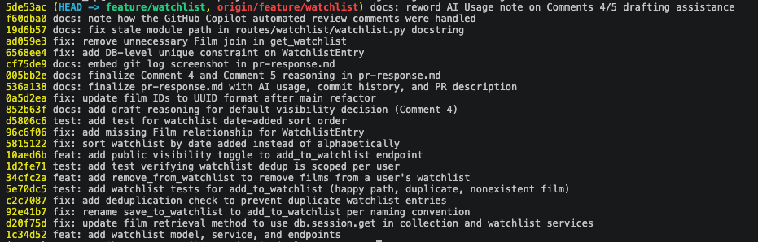

# PR Response Doc — CineLog Watchlist Feature

## AI Usage
I used Claude Code (an AI coding assistant) throughout this project in a few specific ways:

- **Finding the review comments**: No PR existed yet on my fork, so I had Claude query the GitHub REST API against the *upstream* template repo (`jamjamgobambam/ai201-project6-cinelog-starter`) to pull the actual six `@dev-lead` comments (three inline review comments, three issue comments) rather than guessing at their content.
- **Codebase orientation**: Before touching any code, I had Claude read `models.py`, `services/collection_service.py`, and `tests/test_collection.py` in full and identify the conventions to reuse — the `FooNotFoundError`/`AlreadyInFooError`/`NotInFooError` exception naming, the `verb_to_noun` function pattern, the dedup-via-`.filter_by().first()` shape, and the `app`/`sample_user`/`sample_film` pytest fixture structure. Every code change (rename, dedup, tests, `remove_from_watchlist`, visibility toggle, sort order) was written to mirror an existing pattern found this way, not invented from scratch.
- **Rebase mechanics**: I had Claude run `git merge-tree` before doing the real rebase to predict exactly what would happen — it correctly identified that the rebase would produce *no textual conflict markers* (the watchlist branch never touches `models.py`), and that the real problem was semantic: `main`'s refactor commit deleted the `WatchlistEntry` class outright. That prediction turned out to be exactly right and saved time diagnosing the post-rebase import error.
- **Catching a real bug via tests, not trusting the code as-is**: writing the required test for Comment 5 (sort order) surfaced a genuine pre-existing bug — `Film` had no relationship back to `WatchlistEntry`, so `entry.film` in `get_watchlist()` would have thrown `AttributeError` the first time that endpoint was actually hit in production. This wasn't something any AI summary caught by reading the code; it only showed up by actually running the test suite, which is the verification discipline the assignment asks for.
- **Comments 4 and 5 (design decisions)**: I asked Claude to give me a clear, opinionated draft for the choices in Comments 4 and 5 — the default visibility and the sort order. I read them, then decided what I agreed or disagreed with, and rewrote the explanations in my own words.

## Comment 1 — Rename
**What I did:** Renamed `save_to_watchlist()` to `add_to_watchlist()` in `services/watchlist_service.py` to match the `verb_to_noun` convention the reviewer pointed to (`add_to_collection()`, `remove_from_collection()`, `get_collection()` in `services/collection_service.py`).

**How I verified:** Ran `grep -rn "save_to_watchlist" --include="*.py" .` across the whole repo before renaming to find every call site — it turned up exactly two hits: the definition in `services/watchlist_service.py:12` and one call site in `routes/watchlist/watchlist.py` (both the import and the call inside `add_film()`). Updated both. Re-ran the same grep after the change and it returned nothing, confirming no stale references. Also ran `pytest tests/ -v` (all 4 existing collection tests still pass, since this rename doesn't touch that module) and did a quick `create_app()` import smoke test to confirm the route module still imports cleanly with the new name.

## Comment 2 — Deduplication
**What I did:** Looked at `add_to_collection()` in `services/collection_service.py` first — it queries `CollectionEntry.query.filter_by(user_id=user_id, film_id=film_id).first()` before inserting and raises a dedicated `AlreadyInCollectionError` if a row already exists, rather than silently ignoring the duplicate or letting a DB integrity error bubble up. I followed the exact same shape for the watchlist: added an `AlreadyInWatchlistError` exception class and, inside `add_to_watchlist()`, a `WatchlistEntry.query.filter_by(user_id=user_id, film_id=film_id).first()` check that raises before any insert happens. Also updated `routes/watchlist/watchlist.py` to catch this new error and return `409`, matching how `routes/collection.py` handles `AlreadyInCollectionError` (and added a `404` handler for `FilmNotFoundError` in the same route, which the route was missing before).

**How I verified:** Wrote a quick manual script (`add_to_watchlist` twice with the same user/film) confirming the second call raises `AlreadyInWatchlistError` instead of creating a second row, and that a call with a made-up `film_id` still raises `FilmNotFoundError`. Also re-ran `pytest tests/ -v` to confirm the existing collection tests are unaffected. Formal `test_watchlist.py` coverage for this comes in Comment 3.

## Comment 3 — Missing test
**What I did:** Created `tests/test_watchlist.py`, using the exact same fixture structure as `tests/test_collection.py` (`app`, `sample_user`, `sample_film` — same in-memory SQLite setup and teardown). Modeled `test_add_to_watchlist_nonexistent_film_raises` directly on `test_add_to_collection_nonexistent_film_raises`: it uses the same fake-UUID literal (`"00000000-0000-0000-0000-000000000000"`) and asserts `FilmNotFoundError` is raised. Per `CONTRIBUTING.md`'s rule that any new service function needs a happy-path test, a duplicate/conflict test, and a nonexistent-ID test, I also added `test_add_to_watchlist_creates_entry` (happy path) and `test_add_to_watchlist_duplicate_raises` (verifies the Comment 2 dedup fix) in the same file, mirroring `test_collection.py`'s equivalent three tests.

**How I verified:** Ran `pytest tests/test_watchlist.py -v` — all 3 tests pass — then `pytest tests/ -v` for the full 7-test suite (existing collection tests + new watchlist tests), all green.

## Stretch — remove_from_watchlist()
**What I did:** Added `remove_from_watchlist(user_id, film_id)` to `services/watchlist_service.py`, following `remove_from_collection()`'s exact pattern in `services/collection_service.py`: look up the entry by `(user_id, film_id)`, raise a dedicated error (`NotInWatchlistError`, new here, mirroring `NotInCollectionError`) if it doesn't exist, otherwise delete and commit and return `True`. Added a matching `DELETE /watchlist/<user_id>/remove` route in `routes/watchlist/watchlist.py`, mirroring `routes/collection.py`'s remove endpoint (same body shape, same 404-on-missing behavior).

**How I verified:** Added `test_remove_from_watchlist_removes_entry` (confirms the row is actually gone from the DB after removal, not just that no exception was raised) and `test_remove_from_watchlist_not_in_watchlist_raises` (confirms removing a film that was never added raises `NotInWatchlistError` rather than silently no-op'ing). Both pass as part of the full `pytest tests/ -v` run (9/9 passing).

## Stretch — Second test
**What I did:** Added `test_add_to_watchlist_same_film_different_users_both_succeed`, which has two different users add the same film to their (separate) watchlists and asserts both succeed and both rows exist.

**Why this edge case:** Comment 2 asked for a dedup check, and the tests in Comment 3 confirm dedup rejects a *repeat* add by the *same* user. But nothing in the existing tests pins down what the dedup key actually is — it would be easy to accidentally implement this as "a film can only be on one watchlist, period" (e.g. a unique constraint on `film_id` alone) instead of "a user can't add the same film twice" (unique on `(user_id, film_id)`). Since watchlists are personal by design, silently blocking a second user from watchlisting a popular film would be a real, easy-to-miss bug that the required tests wouldn't catch. This test locks in the correct scope of the dedup logic added in Comment 2.

## Stretch — Visibility toggle endpoint
**What I did:** Added a `public` keyword parameter to `add_to_watchlist(user_id, film_id, public=True)`, passed straight through to the `WatchlistEntry` constructor. `POST /watchlist/<user_id>/add` now reads `public` from the JSON body via `data.get("public", True)` — if the caller omits it, behavior is unchanged (defaults to `True`, same as the model's own column default); if they pass `false`, that value is respected on the created entry. This lets a caller set visibility explicitly at creation time instead of always inheriting the model default, which is what Comment 4 asked for. Added `test_add_to_watchlist_public_false_is_respected` to confirm the override actually persists.

## Comment 4 — Default visibility

**My position:** I think keeping watchlists public by default is the right choice.

**Reasoning:** CineLog already treats your logged movies — the ones you've watched and rated — as automatically visible to friends. There's no privacy toggle on those entries, so the app already leans toward sharing film activity. A watchlist is basically the next step in that same social loop: it lets friends see what you plan to watch, which helps spark recommendations, shared interests, and discovery before anyone has actually pressed play.

If watchlists started out private, most people would never change the setting. Research on opt-in defaults shows that users almost never adjust visibility toggles, even when they care about the issue. So whatever CineLog chooses as the default becomes the behavior for almost everyone. Since the app already treats "movie activity" as public by default, making watchlists private would create a weird mismatch where one type of film activity is visible and the other is quietly hidden.

**Tradeoff acknowledged:** However, there is a downside. Watchlist exposes intent, not history. It shows movies someone hasn't watched yet, which can feel more personal — maybe they're embarrassed about a genre, or maybe they use the watchlist as a private scratchpad instead of a social feature. A private default would protect those users better.

That's why the `public` flag exists on `add_to_watchlist()`: it gives people (or a future settings screen) a way to mark specific entries as private without removing the social discovery benefits for everyone else.

## Comment 5 — Sort order

**My position:** I'm siding with the maintainer here: the watchlist should show the newest additions first, so sorting by `date_added.desc()` makes more sense than alphabetical order.

**Reasoning:** A watchlist isn't a library you browse a to z — it's a running list of recent intentions. CineLog already treats the collection this way: `get_collection()` sorts by most recently logged, because people want to see what they just added at the top. The watchlist is the same kind of timeline, just for "I want to watch this" instead of "I watched this."

Alphabetical sorting actually works against how people use a watchlist. When someone opens it, they're usually deciding what to watch next, and recency is a better signal of what's currently on their mind than the first letter of a title. Keeping the sort order consistent with the collection also avoids a strange mismatch where one part of the app is chronological and the other is alphabetical for no real benefit.

**Engagement with reviewer's point:** The maintainer's argument — users want to see what they added most recently — is exactly the same logic behind the collection's sort order. There's no strong reason for the watchlist to behave differently.

Where I'd add a subtle difference: if CineLog eventually supports very large watchlists (hundreds of films), alphabetical sorting becomes useful as a lookup tool. But that's a power-user scenario and not the common case. The right solution then would be a sort toggle or client-side switch, not changing the default. Defaults should serve the majority, and the majority cares about recentness.

## Comment 6 — Rebase
**What conflicted:** While this branch was open, `main` merged a refactor (`refactor: migrate film IDs from integer to UUID`) that changed `Film.id` from `db.Integer` to `db.String(36)` (UUID), and — since the watchlist feature doesn't exist on `main` — that same refactor commit deleted the `WatchlistEntry` class from `models.py` entirely. Running `git fetch origin && git rebase origin/main` actually produced **no textual conflict markers**: the watchlist branch never touched `models.py` before this, so replaying its commits on top of `main` applied cleanly. The real problem was semantic, not textual — after the clean rebase, `services/watchlist_service.py` still did `from models import Film, WatchlistEntry`, but `WatchlistEntry` no longer existed anywhere in `models.py`, which would fail at import time.

**How I resolved it:** Re-added the `WatchlistEntry` class to `models.py`, in the same place it used to live, but with `film_id = db.Column(db.String(36), db.ForeignKey("film.id"), nullable=False)` instead of `db.Integer` — matching how `CollectionEntry.film_id` was migrated in the same refactor commit. Kept `date_added` and `public` unchanged. Also cleaned up a stale docstring in `watchlist_service.py` that said `film_id (int): ID of the film. (Note: integer — pre-refactor)`, updating it to reflect UUIDs. Rebasing also replayed my earlier "add missing Film relationship for WatchlistEntry" fix commit, which references `"WatchlistEntry"` by string name in `db.relationship(...)` — that line landed fine once the class existed again, but would have caused a mapper configuration error at app-startup time if I'd only fixed the import and not the model.

**How I verified no conflict remains:** Ran `pytest tests/ -v` after the rebase — all 12 tests pass, now running against UUID `Film.id` end to end (via the shared `sample_film` fixture, which creates a `Film` row and lets the model assign its own UUID). Confirmed with `git log --merges --oneline origin/main..HEAD` (empty output) that the rebase produced no merge commits, and `git log --oneline origin/main..HEAD` shows a clean, linear history on top of `main`.

## GitHub Copilot automated review

GitHub auto-requested `copilot-pull-request-reviewer` on this PR, which left 5 comments. I checked each against the actual code before acting:

- **Missing `routes/watchlist/__init__.py`** — not applicable. Python 3.11 (what this app runs on) supports implicit namespace packages; I confirmed `create_app()` imports cleanly and the full test suite passes without one.
- **`WatchlistEntry` missing a DB-level unique constraint on `(user_id, film_id)`** — valid. `CollectionEntry` has `unique_user_film_collection`; `WatchlistEntry` didn't have the equivalent, so the service-layer dedup check alone couldn't stop a duplicate under concurrent requests. Added `unique_user_film_watchlist`.
- **Unnecessary `.join(Film)` in `get_watchlist()`** — valid. Left over from switching the sort to `WatchlistEntry.date_added`; the join wasn't doing eager-loading and `get_collection()` doesn't join either. Removed it.
- **Stale module docstring path in `routes/watchlist/watchlist.py`** — valid, trivial. Said `routes/watchlist.py`; fixed to match the real path.
- **`pr-response.md` still had `[DRAFT]` markers** — stale by the time I read it; that review ran against an earlier commit, before I finalized the Comment 4/5 wording and added the screenshot.

## Commit History

`git log --oneline origin/main..HEAD`, showing conventional commit messages with no merge commits:



## PR Description

**What this feature does:** Adds a watchlist to CineLog so users can save films they want to watch later, separate from their collection of films they've already watched. It supports adding a film (`POST /watchlist/<user_id>/add`), viewing a user's watchlist (`GET /watchlist/<user_id>`), and removing a film (`DELETE /watchlist/<user_id>/remove`). Adding the same film twice is rejected rather than creating a duplicate entry, and adding a nonexistent film is rejected with a clear error instead of a database crash.

**Design decisions:**
- **Default visibility** — new watchlist entries default to `public=True` (see Comment 4 for full reasoning), with an explicit `public` parameter/body field so a caller can opt a specific entry out of the default.
- **Sort order** — `GET /watchlist/<user_id>` returns entries sorted by date added, newest first (see Comment 5 for full reasoning), matching the collection endpoint's existing sort behavior.

**How to manually test:**
1. Start the app: `python app.py` (runs on `http://127.0.0.1:5000`).
2. Create a user and a film via the existing endpoints, or use the `sqlite3 cinelog.db` shell to grab existing UUIDs.
3. Add a film to the watchlist:
   ```
   curl -X POST http://127.0.0.1:5000/watchlist/<user_id>/add \
     -H "Content-Type: application/json" \
     -d '{"film_id": "<film_id>"}'
   ```
   Expect `201` with the new entry (including `"public": true`).
4. Repeat the same request — expect `409` (`AlreadyInWatchlistError`).
5. Try a fake `film_id` — expect `404` (`FilmNotFoundError`).
6. View the watchlist: `curl http://127.0.0.1:5000/watchlist/<user_id>` — confirm films are ordered newest-added first.
7. Add a second film with `"public": false` in the body — confirm the response shows `"public": false`.
8. Remove a film: `curl -X DELETE http://127.0.0.1:5000/watchlist/<user_id>/remove -H "Content-Type: application/json" -d '{"film_id": "<film_id>"}'` — expect `200`, then confirm it's gone from the `GET` response.
9. Run the automated suite: `pytest tests/ -v` — all 12 tests should pass.
